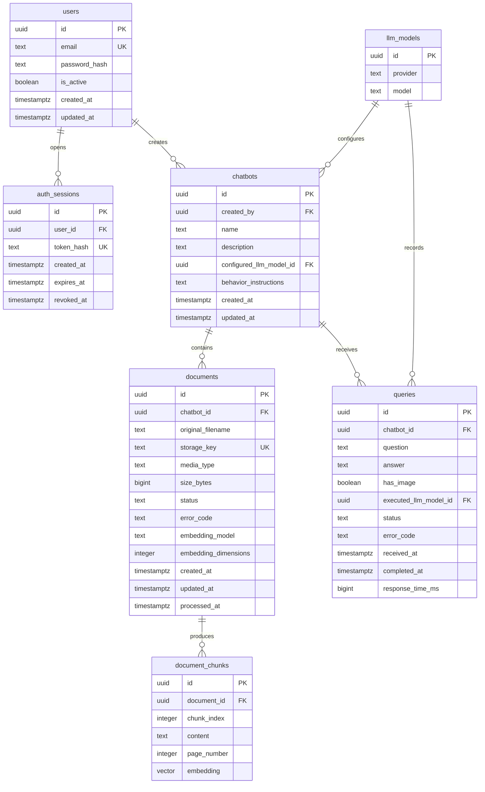

# Diseño de base de datos de BIDACHAT

**Versión:** 0.2 — esquema inicial local

**Fecha:** 2026-09-16

**Alcance:** Version 1 — MVP

**Estado:** esquema inicial aplicado en PostgreSQL + pgvector dentro de Docker; servicios de backend pendientes.

## 1. Resumen para aprobar

Se propone una única base **PostgreSQL + pgvector**, accesible exclusivamente desde FastAPI. Contendrá siete tablas: `users`, `auth_sessions`, `llm_models`, `chatbots`, `documents`, `document_chunks` y `queries`.

La relación central es **chatbot → documentos → fragmentos vectoriales**. Cada consulta pertenece a un chatbot y solo puede recuperar sus fragmentos. El registro de consultas contiene los datos necesarios para calcular las métricas sin mantener contadores duplicados.

Este diseño se deriva del [SRS.md](../SRS.md), aprobado por el usuario como referencia de implementación del MVP el 2026-09-22. [AGENTS.md](../AGENTS.md) establece PostgreSQL, pgvector, separación por chatbot y simplicidad del MVP.

### Decisiones propuestas

| Decisión                                                | Justificación                                                       | Consecuencia que debe aprobarse                                                     |
| ------------------------------------------------------- | ------------------------------------------------------------------- | ----------------------------------------------------------------------------------- |
| Un documento pertenece a un chatbot                     | Simplifica carga, borrado y aislamiento de RF-13/RF-17              | El mismo archivo para dos chatbots se carga dos veces; no hay biblioteca compartida |
| Modelos admitidos en `llm_models`                       | Centraliza las combinaciones seleccionables de proveedor y modelo   | Las combinaciones usadas históricamente se conservan y no se editan                 |
| Modelo e instrucciones seleccionados en `chatbots`      | El chatbot mantiene una sola configuración actual                   | Cambiar el modelo no conserva versiones completas de configuración                  |
| Sesiones revocables en PostgreSQL                       | Permiten invalidar inmediatamente la sesión al cerrar sesión, RF-03 | Se consulta la sesión en cada operación administrativa                              |
| Métricas derivadas de `queries`                         | RF-24–RF-27 requieren consultas y duración                          | No existe una tabla `metrics` ni contadores que sincronizar                         |
| Administradores autorizados comparten gestión           | El SRS no define propietarios exclusivos ni roles distintos         | `created_by` identifica autoría, no restringe acceso por propietario                |
| Eliminación física del chatbot y sus datos dependientes | Ciclo de vida sencillo para RF-07                                   | Se pierden sus consultas y métricas; no hay histórico tras el borrado               |
| Capturas temporales, sin archivo permanente             | RF-12/RF-19 piden procesar imágenes, no conservarlas                | No se puede reconstruir posteriormente la imagen de una consulta                    |
| Embeddings con un perfil global fijo                    | Evita comparar vectores incompatibles                               | Cambiar modelo o dimensión requiere regenerar todo el índice                        |

Estas decisiones son propuestas técnicas. El SRS no fija exclusividad documental, política de retención ni alcance de permisos entre investigadores; deben confirmarse antes de la migración inicial.

## 2. Diagrama de entidades y relaciones

`||` significa exactamente uno; `o{`, cero o muchos. PK es clave primaria, FK es clave foránea y UK es clave única.



El tipo `vector` del diagrama representa **`vector(D)`**, con D recibida desde `EMBEDDING_DIMENSIONS` durante la inicialización. La base local se creó con `vector(768)`. El perfil global seleccionado el 2026-09-21 es `gemini-embedding-2` con salida de 768 dimensiones; cambiar la dimensión exige una migración y cambiar el modelo exige reindexar todo el corpus.

## 3. Justificación de las relaciones

| Relación                      | Cardinalidad | Justificación                                                                                | Integridad propuesta                                                                      |
| ----------------------------- | ------------ | -------------------------------------------------------------------------------------------- | ----------------------------------------------------------------------------------------- |
| `users → auth_sessions`       | 1:N          | Un investigador puede abrir sesiones en distintos dispositivos; cada sesión tiene un usuario | FK obligatoria; borrado de usuario elimina sus sesiones                                   |
| `users → chatbots`            | 1:N          | Permite identificar quién registró el chatbot                                                | FK `created_by` obligatoria; impedir borrar un usuario con chatbots; desactivar la cuenta |
| `llm_models → chatbots`       | 1:N          | Una combinación admitida puede ser seleccionada por varios chatbots                          | FK obligatoria; impedir borrar un modelo configurado                                      |
| `llm_models → queries`        | 1:N          | Conserva el proveedor y modelo realmente usados en cada consulta                             | FK obligatoria; impedir borrar un modelo con historial                                    |
| `chatbots → documents`        | 1:N          | Una base de conocimiento puede tener varios archivos y un chatbot puede existir sin archivos | FK obligatoria; borrado del chatbot elimina sus documentos                                |
| `documents → document_chunks` | 1:N          | Un documento se divide en fragmentos para recuperación semántica                             | FK obligatoria; borrado del documento elimina sus fragmentos                              |
| `chatbots → queries`          | 1:N          | Cada consulta y duración deben atribuirse a un solo chatbot                                  | FK obligatoria; borrado del chatbot elimina sus consultas                                 |

No hay FK de `queries` a `users`: el usuario final del widget no necesita cuenta administrativa. No se crea una entidad de dashboard porque el SRS requiere integración, no administrar dashboards. El fragmento no duplica `chatbot_id`: su chatbot se obtiene mediante su documento, evitando dos referencias que puedan contradecirse.

Un documento en carga o procesamiento puede tener cero fragmentos. Para estar `ready` debe tener al menos uno y todos deben tener embedding válido. Esta condición entre tablas se verifica en la transacción del servicio de documentos; una FK por sí sola no la garantiza.

## 4. Diccionario de datos

Reglas comunes: PK `uuid` generada por el backend; tiempos `timestamptz`, gestionados en UTC; los campos son **NOT NULL salvo donde se indica nullable**. UUID evita depender de secuencias públicas, pero no sustituye autorización. `updated_at` lo actualiza explícitamente el servicio al escribir; un valor por defecto no actualiza el campo automáticamente.

### 4.1 `users` — investigadores autorizados

| Campo           | Tipo        | Regla / propósito                                                                   |
| --------------- | ----------- | ----------------------------------------------------------------------------------- |
| `id`            | uuid        | PK                                                                                  |
| `email`         | text        | No vacío; guardar normalizado con `lower(trim(email))`; UNIQUE sobre `lower(email)` |
| `password_hash` | text        | Hash de contraseña con algoritmo adecuado; nunca contraseña reversible              |
| `is_active`     | boolean     | DEFAULT true; desactivar impide usar incluso sesiones vigentes                      |
| `created_at`    | timestamptz | DEFAULT now()                                                                       |
| `updated_at`    | timestamptz | DEFAULT now(); actualización explícita                                              |

Se propone aprovisionamiento inicial controlado desde backend, sin registro público ni jerarquía de roles. El mecanismo exacto de hash se elegirá al implementar autenticación. No se almacenan claves Gemini aquí.

### 4.2 `auth_sessions` — acceso y cierre de sesión

| Campo        | Tipo        | Regla / propósito                                                               |
| ------------ | ----------- | ------------------------------------------------------------------------------- |
| `id`         | uuid        | PK                                                                              |
| `user_id`    | uuid        | FK → users.id, ON DELETE CASCADE                                                |
| `token_hash` | text        | UNIQUE; digest de token aleatorio de alta entropía, nunca el token reutilizable |
| `created_at` | timestamptz | DEFAULT now()                                                                   |
| `expires_at` | timestamptz | Mayor que `created_at`; vigencia configurable                                   |
| `revoked_at` | timestamptz | Nullable; si existe, >= `created_at`                                            |

El token se entrega mediante cookie `HttpOnly`, `Secure` en despliegue y política `SameSite` compatible con la topología elegida; las operaciones mutables necesitan protección CSRF. Cada petición verifica token, expiración, revocación y usuario activo. Cerrar sesión revoca la fila y elimina la cookie. La duración de sesión queda por definir, sin inventar un umbral del SRS.

### 4.3 `llm_models` — catálogo de modelos admitidos

| Campo      | Tipo | Regla / propósito                                                                              |
| ---------- | ---- | ---------------------------------------------------------------------------------------------- |
| `id`       | uuid | PK                                                                                             |
| `provider` | text | No vacío; normalizado en minúsculas y sin espacios exteriores; por ejemplo `gemini` u `ollama` |
| `model`    | text | No vacío y sin espacios exteriores; identificador reconocido por el proveedor                  |

La combinación (`provider`, `model`) es UNIQUE. El backend determinará qué proveedores están admitidos; guardar texto no autoriza destinos arbitrarios. Un trigger de PostgreSQL impide modificar la identidad de una combinación: para cambiarla se crea otra fila. Las FK con ON DELETE RESTRICT impiden borrar una combinación referenciada. Así, el historial no cambia indirectamente cuando se modifica el catálogo o la configuración de un chatbot.

Las credenciales del proveedor externo y la dirección del servicio Ollama permanecen en configuración del backend. No se almacenan claves, URLs ni parámetros de conexión en esta tabla.

### 4.4 `chatbots` — identidad y configuración actual

| Campo                     | Tipo        | Regla / propósito                                                    |
| ------------------------- | ----------- | -------------------------------------------------------------------- |
| `id`                      | uuid        | PK; identificador público estable del widget                         |
| `created_by`              | uuid        | FK → users.id, ON DELETE RESTRICT                                    |
| `name`                    | text        | `CHECK (length(trim(name)) > 0)`; no se exige unicidad no solicitada |
| `description`             | text        | Nullable; texto descriptivo                                          |
| `configured_llm_model_id` | uuid        | FK → llm_models.id, ON DELETE RESTRICT; selección actual             |
| `behavior_instructions`   | text        | DEFAULT ''; rol, tono y reglas como instrucciones unificadas         |
| `created_at`              | timestamptz | DEFAULT now()                                                        |
| `updated_at`              | timestamptz | DEFAULT now(); actualización explícita                               |

El modelo generativo seleccionado es independiente del modelo de embeddings. Cambiar `configured_llm_model_id` no modifica el identificador del widget ni obliga por sí mismo a reindexar documentos. Version 1 admite proveedor externo y Ollama local; su ejecución se formaliza y prueba en el cambio `add-local-ollama-provider`.

El snippet del widget se deriva del identificador y de las URLs de despliegue: no necesita tabla ni token secreto. Conocer este identificador permite llamar al endpoint público; las rutas administrativas siempre requieren sesión y los controles de abuso se aplican en backend.

### 4.5 `documents` — fuentes documentales y procesamiento

| Campo                  | Tipo        | Regla / propósito                                                          |
| ---------------------- | ----------- | -------------------------------------------------------------------------- |
| `id`                   | uuid        | PK                                                                         |
| `chatbot_id`           | uuid        | FK → chatbots.id, ON DELETE CASCADE                                        |
| `original_filename`    | text        | Nombre informativo, nunca usado como ruta de almacenamiento                |
| `storage_key`          | text        | UNIQUE; clave interna generada, relativa al volumen privado                |
| `media_type`           | text        | Tipo validado por contenido y lista permitida                              |
| `size_bytes`           | bigint      | CHECK > 0; límite de carga configurable en backend                         |
| `status`               | text        | CHECK IN ('pending', 'processing', 'ready', 'failed'); DEFAULT 'pending'   |
| `error_code`           | text        | Nullable; código controlado, sin trazas ni secretos                        |
| `embedding_model`      | text        | Nullable antes de procesar; identificador del modelo del perfil global     |
| `embedding_dimensions` | integer     | Nullable antes de procesar; cuando exista debe coincidir con D del esquema |
| `created_at`           | timestamptz | DEFAULT now()                                                              |
| `updated_at`           | timestamptz | DEFAULT now(); seguimiento del procesamiento                               |
| `processed_at`         | timestamptz | Nullable hasta finalizar correctamente                                     |

Los campos de modelo y dimensión deben ser ambos nulos o ambos no nulos. En `pending` son nulos; en `processing` ya están definidos. En `ready`, ambos y `processed_at` son obligatorios; `error_code` es nulo. En `failed`, `error_code` es obligatorio y `processed_at` es nulo; en otros estados el error es nulo. El esquema exige la dimensión D y el servicio deberá validar el modelo del perfil global.

Los originales se conservan en un volumen privado para poder reprocesarlos, sin introducir un servicio de almacenamiento adicional. La BD guarda referencias y metadatos, no binarios ni base64. Los tipos y tamaños concretos se definirán antes del endpoint de carga; RS-06 exige validarlos, pero no da valores.

### 4.6 `document_chunks` — unidad de recuperación RAG

| Campo         | Tipo      | Regla / propósito                                                        |
| ------------- | --------- | ------------------------------------------------------------------------ |
| `id`          | uuid      | PK                                                                       |
| `document_id` | uuid      | FK → documents.id, ON DELETE CASCADE                                     |
| `chunk_index` | integer   | CHECK >= 0; UNIQUE (`document_id`, `chunk_index`)                        |
| `content`     | text      | Texto no vacío utilizado como contexto                                   |
| `page_number` | integer   | Nullable; CHECK > 0 cuando exista; ubicación en documentos paginados     |
| `embedding`   | vector(D) | NOT NULL; D fija; vector finito y no nulo en norma para distancia coseno |

No se crea otra tabla de embeddings: hay un vector por fragmento en el MVP. `page_number` identifica el inicio si un fragmento abarca más de una página. El orden se mantiene con `chunk_index`.

### 4.7 `queries` — consulta, resultado y medición

| Campo                   | Tipo        | Regla / propósito                                                                |
| ----------------------- | ----------- | -------------------------------------------------------------------------------- |
| `id`                    | uuid        | PK; identifica un intento aceptado                                               |
| `chatbot_id`            | uuid        | FK → chatbots.id, ON DELETE CASCADE                                              |
| `question`              | text        | No vacío después de trim                                                         |
| `answer`                | text        | Nullable durante procesamiento o ante fallo; obligatoria y no vacía al completar |
| `has_image`             | boolean     | DEFAULT false; indica si se incorporó una imagen admitida                        |
| `executed_llm_model_id` | uuid        | FK → llm_models.id, ON DELETE RESTRICT; modelo usado en este intento             |
| `status`                | text        | CHECK IN ('processing', 'completed', 'failed'); DEFAULT 'processing'             |
| `error_code`            | text        | Nullable; obligatorio solo en fallo, con código controlado                       |
| `received_at`           | timestamptz | Momento de recepción de la solicitud en el backend                               |
| `completed_at`          | timestamptz | Nullable hasta terminar; >= `received_at`                                        |
| `response_time_ms`      | bigint      | Nullable durante procesamiento; CHECK >= 0 cuando exista                         |

Invariante propuesta: `processing` no tiene respuesta, error ni tiempos finales; `completed` tiene respuesta, tiempos finales y ningún error; `failed` tiene error y no respuesta. En fallos normales se registran tiempos finales. En interrupciones del proceso se permite `failed` con ambos tiempos finales nulos, porque la duración real no pudo observarse. No se fabrica un tiempo para esos casos.

Cada solicitud válida aceptada crea una fila y copia la referencia `configured_llm_model_id` del chatbot en `executed_llm_model_id` al admitirla. Las solicitudes rechazadas por validación o control de abuso quedan fuera de estas métricas funcionales. Un reenvío del usuario es otro intento. No se implementa deduplicación por texto: dos preguntas iguales pueden ser consultas legítimas.

Se propone conservar pregunta y respuesta para identificar el registro; el SRS no exige un historial conversacional navegable. El plazo de retención y el acceso al contenido deben aprobarse. No se conservan capturas, IP ni huellas de visitantes en esta tabla.

## 5. Normalización y decisiones de simplicidad

Cada tabla representa una entidad con su propia clave. Los datos de usuario no se copian en chatbots, ni los datos documentales en cada consulta. Las relaciones se expresan con FK obligatorias.

Las dos referencias a `llm_models` son deliberadas: `queries.executed_llm_model_id` describe un hecho histórico, mientras `chatbots.configured_llm_model_id` describe la configuración actual. `documents.embedding_model` y su dimensión documentan cómo se procesó cada fuente y permiten detectar índices obsoletos. Ningún dato histórico se actualiza al cambiar el modelo del chatbot.

Alternativas consideradas:

| Alternativa                             | Motivo para no incluirla inicialmente                                                            | Qué cambio la justificaría                                               |
| --------------------------------------- | ------------------------------------------------------------------------------------------------ | ------------------------------------------------------------------------ |
| `chatbot_documents` N:M                 | Compartir documentos no está explícitamente requerido; añade permisos y ciclo de vida compartido | Biblioteca reutilizable aprobada                                         |
| `chatbot_configurations` 1:1            | Mismos permisos y ciclo de vida que chatbot                                                      | Versionado o varias configuraciones aprobadas                            |
| `metrics` separada                      | Duplica hechos que ya existen en consultas                                                       | Métricas independientes o agregación materializada medida como necesaria |
| `conversations`, `messages`, visitantes | El SRS no requiere memoria persistente ni usuarios finales identificados                         | Historial/memoria multi-turno aprobado                                   |
| `dashboards`, integraciones por dominio | El widget puede usar un chatbot por identificador estable                                        | Gestión de dashboards o políticas por integración aprobadas              |
| `query_sources`                         | La reconstrucción histórica exacta del contexto no está requerida                                | Auditoría/citas persistentes con requisitos de retención                 |
| Catálogo de roles                       | No existe gestión de roles diferenciados en el MVP                                               | Administración de roles aprobada                                         |

## 6. Aislamiento y consulta vectorial

El backend resuelve el chatbot desde la ruta y limita todos los accesos a ese contexto. Para leer/modificar un documento se busca por **id del documento y id del chatbot**, nunca solo por el id recibido. Las FK impiden huérfanos, pero no autorizan al llamante.

Ejemplo conceptual de recuperación parametrizada (solo documentación):

```sql
SELECT c.id, c.content, c.page_number,
       c.embedding <=> CAST(:query_embedding AS vector) AS distance
FROM document_chunks AS c
JOIN documents AS d ON d.id = c.document_id
WHERE d.chatbot_id = :chatbot_id
  AND d.status = 'ready'
  AND d.embedding_model = :embedding_model
  AND d.embedding_dimensions = :embedding_dimensions
ORDER BY distance, c.id
LIMIT :top_k;
```

Los parámetros de embedding y `top_k` proceden del servicio RAG, con validación. Nunca se hace una búsqueda global para después filtrar en Python. El contexto y la configuración se obtienen para el mismo chatbot; el cliente no puede sustituirlos mediante campos del cuerpo.

La búsqueda exacta inicial evita introducir un índice aproximado sin volumen ni mediciones. pgvector permite búsqueda exacta y aproximada; sus operadores y restricciones se verificarán contra la versión fijada al implementar. [Referencia oficial de pgvector](https://github.com/pgvector/pgvector).

El perfil seleccionado es `gemini-embedding-2` con `output_dimensionality=768`. La documentación oficial indica que admite entrada multimodal, permite dimensiones entre 128 y 3072, recomienda 768 entre sus tamaños habituales y normaliza automáticamente las salidas truncadas. Esto conserva `vector(768)` y el alcance multimodal del MVP. Documentos y consultas deben usar exactamente ese modelo y dimensión; no se mezclarán modelos del mismo tamaño como si fueran equivalentes. El modelo generativo configurado por chatbot sigue siendo independiente. [Documentación oficial de embeddings de Gemini](https://ai.google.dev/gemini-api/docs/embeddings).

No se propone RLS inicialmente: el aislamiento se implementa en los servicios y consultas SQL, con pruebas negativas obligatorias. Una omisión del filtro sería una vulnerabilidad; la estructura relacional por sí sola no la evita.

## 7. Índices e integridad

| Tabla             | Índice / restricción                                                    | Acceso que resuelve                                  |
| ----------------- | ----------------------------------------------------------------------- | ---------------------------------------------------- |
| Todas             | PK en `id`                                                              | Identidad y referencias                              |
| `users`           | UNIQUE en `lower(email)`                                                | Login sin duplicados por mayúsculas                  |
| `auth_sessions`   | UNIQUE (`token_hash`), índice (`user_id`), índice (`expires_at`)        | Validación, revocación y limpieza                    |
| `llm_models`      | UNIQUE (`provider`, `model`) y comprobaciones de texto no vacío         | Evitar combinaciones duplicadas                      |
| `chatbots`        | Índices (`created_by`) y (`configured_llm_model_id`)                    | Comprobación de referencias a usuario y modelo       |
| `documents`       | UNIQUE (`storage_key`), índice (`chatbot_id`, `status`)                 | Archivos sin colisión y selección de fuentes listas  |
| `document_chunks` | UNIQUE (`document_id`, `chunk_index`)                                   | Orden y acceso por documento sin duplicar fragmentos |
| `queries`         | Índice (`chatbot_id`, `received_at`) e índice (`executed_llm_model_id`) | Métricas por chatbot y protección de referencias     |

No se duplican índices ya cubiertos por PK/UNIQUE ni se supone que una FK crea automáticamente índice en la tabla hija. PostgreSQL permite especificar FK, unicidad y acciones de borrado; las restricciones entre filas/tablas que no cubran estas herramientas se resuelven con transacciones y pruebas. [Restricciones de PostgreSQL](https://www.postgresql.org/docs/current/ddl-constraints.html).

## 8. Transacciones y ciclo de vida

### Carga y procesamiento

1. Validar sesión, chatbot, archivo y límites antes de incorporarlo al RAG.
2. Escribir el original con clave generada en volumen privado; crear fila `pending`. Si falla el alta, retirar el archivo temporal.
3. Reclamar el documento con cambio condicional `pending → processing`; un solo procesamiento puede ganarlo. Registrar el perfil de embeddings.
4. Extraer texto, dividir y generar vectores fuera de una transacción larga de BD.
5. En una transacción corta, verificar que el documento aún existe y pertenece al chatbot esperado, insertar el conjunto completo de fragmentos y pasar a `ready`.
6. Ante error, marcar `failed`; los fragmentos incompletos nunca están disponibles para recuperar.

Para reintentar, cambiar `failed → pending` y sustituir el conjunto en una transacción. La restricción UNIQUE impide duplicados. La recuperación de trabajos interrumpidos debe distinguir procesos activos de detenidos; con un único proceso MVP se pueden marcar fallidos al reiniciarlo. Antes de usar varios procesos se debe definir reclamación/recuperación segura, sin asumir que todos los trabajos `processing` son huérfanos.

### Consulta y medición

Se toma un reloj monotónico al recibir la petición. Tras validación y admisión se copia `configured_llm_model_id` en `executed_llm_model_id` y se registra `processing` con el `received_at` original. Al finalizar se guardan resultado, estado y duración. No se mantiene una transacción abierta mientras se espera al proveedor configurado.

`response_time_ms` mide desde recepción hasta respuesta lista para entregar desde backend, incluyendo RAG y LLM. No mide el transporte hasta el navegador ni el renderizado: si RNF-06 se interpreta como entrega efectiva al usuario, habrá que añadir medición cliente/confirmación y revisar esta decisión. Las interrupciones no observadas dejan duración nula y se reportan por separado.

### Eliminación y archivos

La eliminación bloquea la fila de chatbot; admisión de consultas/cargas usa un bloqueo compatible que impide aceptar trabajo durante el borrado. Las FK y cascadas eliminan metadatos, fragmentos y consultas atómicamente. Los trabajos que terminen tarde deben detectar que ya no existe el destino y no recrearlo.

La transacción SQL **no elimina archivos del volumen**. El servicio obtiene sus claves antes del borrado, confirma la transacción y después elimina los binarios. Si esta limpieza falla, quedan archivos inaccesibles: una conciliación controlada entre claves de BD y archivos permite retirarlos. No borrar archivos antes del commit, porque un rollback dejaría documentos sin original. Las copias de seguridad deben incluir BD y volumen de forma consistente.

## 9. Métricas sin duplicación

El servicio de métricas agrupa `queries` por chatbot y periodo: consultas aceptadas, completadas, fallidas y en procesamiento. Las duraciones se presentan con su cantidad de muestras y los casos sin medición se distinguen. Para un chatbot sin consultas, el conteo es 0 y la media no está disponible, no 0 ms.

```sql
SELECT COUNT(*) AS total_queries,
       COUNT(*) FILTER (WHERE status = 'completed') AS completed_queries,
       COUNT(*) FILTER (WHERE status = 'failed') AS failed_queries,
       COUNT(*) FILTER (WHERE status = 'processing') AS processing_queries,
       COUNT(response_time_ms) FILTER (
           WHERE status = 'completed'
       ) AS measured_completed_queries,
       AVG(response_time_ms) FILTER (
           WHERE status = 'completed'
       ) AS average_response_time_ms
FROM queries
WHERE chatbot_id = :chatbot_id
  AND received_at >= :start_at
  AND received_at < :end_at;
```

El intervalo es semiabierto para evitar doble conteo entre periodos consecutivos. La media ilustrada corresponde a éxitos; las duraciones de fallos se consultan separadamente. No se establece un objetivo de latencia ni métricas de visitantes únicos que el SRS no exige.

## 10. Trazabilidad y pruebas de aceptación previstas

Las pruebas de autenticación, CRUD/configuración, carga documental, publicación/recuperación RAG y registros/agregación de métricas ya se ejecutaron contra el contenedor PostgreSQL/pgvector. Los flujos consumidores de LLM, widget y eliminación coordinada siguen pendientes.

| Requisitos                       | Criterios                                       | Elementos                       | Verificación futura                                                        |
| -------------------------------- | ----------------------------------------------- | ------------------------------- | -------------------------------------------------------------------------- |
| RF-01–RF-03, RS-01/RS-02         | CA-UC01-01 a CA-UC01-04                         | users, auth_sessions            | Login válido/inválido; revocación inmediata; expiración y cuenta inactiva  |
| RF-04–RF-07                      | CA-UC02-01 a CA-UC02-04                         | chatbots                        | CRUD; referencia de autor; eliminación sin dependientes huérfanos          |
| RF-08/RF-09/RF-11, RNF-05/RNF-10 | CA-UC03-01 a CA-UC03-04                         | llm_models, chatbots, documents | Configuración persistida, modelo admitido y asociación correcta            |
| RF-13–RF-15, RS-05/RS-06         | CA-UC04-01 a CA-UC04-03                         | documents, document_chunks      | Carga válida; rechazo de tipo/tamaño; atomicidad y reintentos              |
| RF-16/RF-17, RS-07               | CA-UC04-04/CA-UC04-05                           | JOIN filtrado                   | Vector de A nunca devuelve contenido de B; acceso cruzado por id rechazado |
| RF-10/RF-23, RNF-01/RNF-02       | CA-UC05-01 a CA-UC05-04                         | chatbot id estable              | Widget llama API; cambiar modelo no cambia snippet                         |
| RF-18/RF-20–RF-22                | CA-UC06-01 a CA-UC06-04                         | queries y servicios             | Texto + contexto correcto; respuesta e indicador de procesamiento          |
| RF-12/RF-19/RF-20                | CA-UC07-01 a CA-UC07-04                         | has_image y flujo temporal      | Imagen llega al contexto; no se persiste como fuente de otro chatbot       |
| RF-24–RF-27, RNF-06/RNF-07       | CA-UC06-05, CA-UC07-05, CA-UC08-01 a CA-UC08-04 | queries y agregación            | Medición, asociación, fallos, cero consultas, acceso autorizado            |
| RS-03/RS-04/RS-08/RS-09          | Revisión de seguridad del MVP                   | Infraestructura y backend       | TLS, secretos externos, control de abuso y errores sanitizados             |

Además: rechazar FK inexistentes, fragmentos repetidos, vectores de otra dimensión/perfil, duraciones negativas y estados incompatibles; probar borrado concurrente con procesamiento/consulta y limpieza del volumen. Las pruebas de FK, cascadas y vectores deben ejecutarse contra PostgreSQL con pgvector, no sustituirse por SQLite.

## 11. Aprobación y siguiente paso

- [x] Confirmar el SRS 0.1 como referencia para implementación del MVP: aprobado por el usuario el 2026-09-22.
- [x] Inicialización local de las siete tablas y sus relaciones autorizada por el usuario el 2026-09-16.
- [x] Confirmar documentos exclusivos por chatbot frente a biblioteca compartida.
- [x] Confirmar gestión compartida entre investigadores; `created_by` no es permiso de propietario.
- [x] Aprobar borrado en cascada, incluida pérdida de consultas y métricas del chatbot.
- [x] Definir retención de originales, preguntas y respuestas; confirmar capturas temporales.
- [x] Aprobar la definición de tiempo de respuesta y tratamiento de fallos sin medición.
- [x] Seleccionar un perfil de embeddings compatible con la dimensión local 768 o migrarla antes de cargar documentos: `gemini-embedding-2` con salida 768, seleccionado el 2026-09-21.

El usuario aprobó estas decisiones el 2026-09-22. Los documentos son exclusivos por chatbot; los investigadores autenticados comparten la gestión; el borrado es físico en cascada; los originales se conservan en volumen privado para reproceso; las capturas son temporales; y la duración se mide hasta que backend deja lista la respuesta, con duración nula para fallos no observados. La carga administrativa admite PDF, DOCX, TXT y CSV, hasta 20 MiB por archivo. Levantar la base no declara funcional el MVP ni autoriza un despliegue de producción.

## 12. Decisión integrada: inferencia seleccionable

**Decisión del usuario:** la inferencia podrá ejecutarse con un proveedor externo de IA o con un modelo local mediante Ollama. Ambas opciones serán seleccionables en la configuración del chatbot durante Version 1. El diseño incorpora `llm_models` para representar las combinaciones admitidas; la implementación se planifica en `add-local-ollama-provider`.

Redacción del requisito para incorporar a la versión correspondiente:

> El sistema deberá permitir seleccionar, para cada chatbot, el proveedor y el modelo de inferencia, admitiendo un proveedor externo de IA o un modelo ejecutado localmente mediante Ollama.

### Representación en los datos

- `llm_models` almacena cada pareja única (`provider`, `model`), por ejemplo proveedor `gemini` u `ollama` y el identificador de su modelo.
- `chatbots.configured_llm_model_id` selecciona una fila del catálogo como configuración actual.
- `queries.executed_llm_model_id` conserva la fila realmente utilizada en cada intento. La edición del chatbot no cambia este registro histórico.
- Mantener credenciales y direcciones de conexión en configuración controlada del backend. El selector del chatbot no necesita guardar claves privadas ni URLs arbitrarias.
- Conservar las demás entidades y relaciones sin cambiar la asociación entre documentos y chatbots.

### Impacto previsto en el RAG

La recuperación de contexto sigue usando PostgreSQL/pgvector y el filtro por chatbot. El backend entrega ese contexto al proveedor y modelo seleccionados. El widget conserva su comunicación con la API.

La elección del modelo generativo es independiente del perfil de embeddings. Cambiar solo la inferencia no requiere regenerar los vectores. Seleccionar Ollama para inferencia no garantiza funcionamiento sin Internet si los embeddings u otros componentes siguen dependiendo de servicios externos.

Antes de implementar se definirán las capacidades exigidas a cada combinación, especialmente para consultas con imágenes. El modo local deberá contemplar esa compatibilidad para cubrir los requisitos multimodales de la versión que lo incorpore. La conmutación automática a un proveedor distinto no forma parte de la selección solicitada.

## 13. Funcionamiento en contenedores Docker

### Despliegue local actual

`docker-compose.yml` levanta el servicio `database` usando una imagen pgvector fijada por digest. Se verificaron PostgreSQL **16.15** y pgvector **0.8.6**. El volumen `bidachat_postgres_data` conserva la base al detener o recrear el contenedor; el puerto se publica únicamente en `127.0.0.1:5433`.

```text
Equipo de desarrollo → localhost:5433 → contenedor database:5432
                                            │
                                            └── volumen postgres_data

Futuro backend FastAPI en Compose → database:5432
Frontend y widget → API FastAPI
```

Las credenciales se leen del `.env` local, que Git ignora. El futuro backend usará el nombre de servicio `database` dentro de la red Compose; `localhost` dentro de un contenedor identifica ese mismo contenedor, no PostgreSQL. El usuario configurado en esta inicialización es el propietario local de la base; los permisos de la conexión de aplicación se definirán al integrar FastAPI.

### Flujo de datos de una consulta

1. El investigador selecciona una fila de `llm_models`; `chatbots.configured_llm_model_id` queda asociado a esa combinación.
2. Al aceptar una consulta, el backend obtiene esa configuración y la guarda como `queries.executed_llm_model_id`. Ese mismo modelo se utiliza durante toda la ejecución, aunque se edite después el chatbot.
3. El RAG recupera fragmentos mediante `document_chunks → documents → chatbot`, filtrando por el chatbot de la consulta.
4. El backend entrega pregunta y contexto al proveedor/modelo referenciado por la consulta, no a una configuración releída después.
5. Guarda respuesta, estado y duración en `queries`. Las métricas se calculan desde esos registros.

Ejemplo: una consulta ejecutada con Gemini conserva esa referencia. Cambiar `configured_llm_model_id` a una fila Ollama solo afecta a las consultas nuevas. No mantiene una llamada activa ni una dependencia de Gemini para leer la respuesta histórica.

### Inicialización y actualización

El script `docker/postgres/init-database.sh` valida `EMBEDDING_DIMENSIONS` y ejecuta `database/migrations/001_initial_schema.up.sql` con una variable de `psql`. Docker lo ejecuta solo al crear un volumen vacío. Los archivos SQL se montan como solo lectura; editarlos no altera una base existente automáticamente.

Los cambios posteriores se aplicarán como migraciones nuevas. La reversión `001_initial_schema.down.sql` se probó únicamente sobre la base local sin filas y se reaplicó inmediatamente; no es un procedimiento de actualización de una base con datos.

### Comprobaciones ejecutadas

`database/tests/verify_initial_schema.sql` comprobó las siete tablas y la extensión vector; la separación entre configuración actual e historial; unicidad de proveedor/modelo; protección contra edición y borrado del modelo histórico; FK inexistentes; expiración inválida de sesiones; estados finales incompletos; duración negativa; fragmentos duplicados; vectores de dimensión incompatible y vectores de norma cero; y borrado en cascada de dependientes del chatbot.

Las pruebas usan una transacción con ROLLBACK, de modo que no dejan usuarios, modelos, documentos ni consultas de prueba. La base quedó sin filas y disponible para integrar el backend. Los controles de autorización, publicación de documentos listos, llamadas LLM y aislamiento de servicios aún requieren código y pruebas de aplicación.
